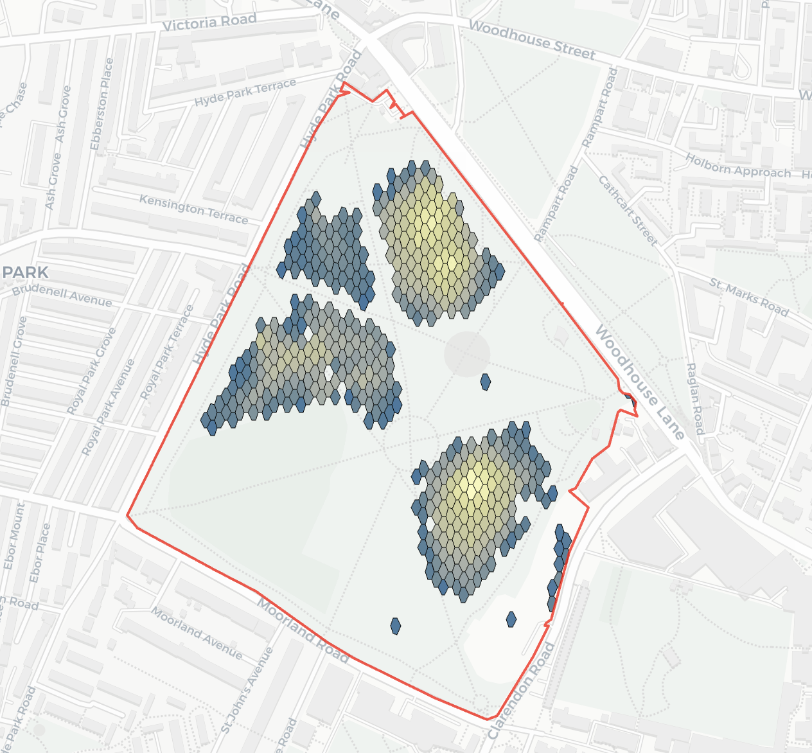

# Visualisation plan for both visibility and foliage coverage

Generally, I think since teh dataset underlying is on a hex grid, it makes sense to use a hex grid for visualisation!

Generally, I think the approach should be:

- From the point data (each point has a value, either foliage coverate or visibility %), create a voronoi tesselation to rebuild the hexagonal grid
- Then if needed, filter this resulting grid to remove unwanted values (e.g. low visibility/low foliage etc.)
